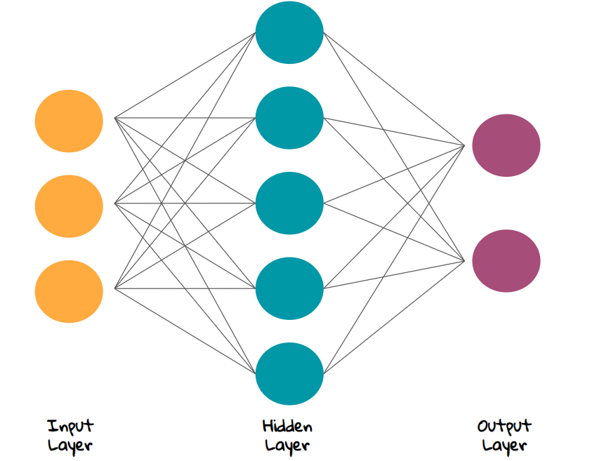

```{r setup, include=FALSE}
knitr::opts_chunk$set(echo = TRUE)
```

3. One job that is related to data science is a **machine learning engineer**. At [large companies](https://www.google.com), there are employees whose job it is to take a dataset generated by their software through a process of cleaning, filtering, and analyzing. After all of the *legwork* has been completed, the machine learning engineer takes the data and begins to develop a model. As more and more data is fed into the model, it becomes more and more accurate at future predictions. 

4. **R Version:** 
```{r}
version
```

6. **Git Version:** 2.20.1

8. **Git Username:** elimusgrove